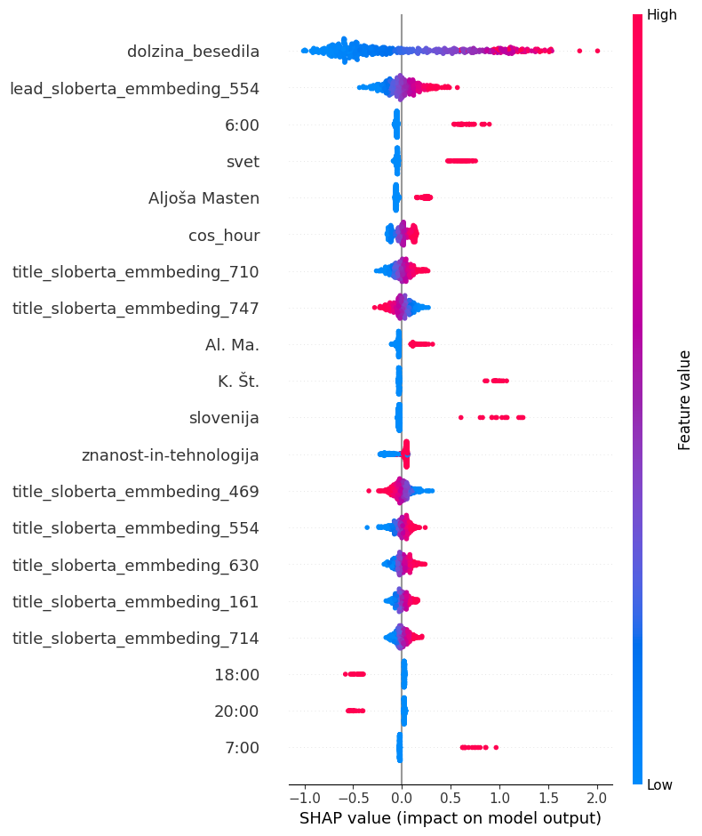

# RTVSlo Comment Prediction

Projekt uporablja napredno obdelavo naravnega jezika (NLP), strojno učenje in globoko učenje za napovedovanje števila komentarjev na članke RTV Slovenija na podlagi vsebine in metapodatkov.

## Funkcionalnosti

- Prevajanje slovenskih naslovov v angleščino (Helsinki-NLP model).
- Lematizacija slovenskega besedila z uporabo modela SloBERTa.
- Ustvarjanje več vrst vektorskih predstavitev (TF-IDF, sentence embeddings, SloBERTa embeddings).
- Dodajanje temporalnih, vsebinskih in avtorjevih značilnosti.
- Napovedovanje števila komentarjev z nevronsko mrežo v PyTorch.
- Vgrajena podpora za grid search in validacijo modela.

## Tehnologije

- Python
- PyTorch
- HuggingFace Transformers
- SentenceTransformers
- Scikit-learn
- SciPy, NumPy, tqdm
- Helsinki-NLP (prevajanje)
- SloBERTa (EMBEDDIA)

## Odvisnosti

Namesti vse zahtevane knjižnice:

```bash
pip install -r requirements.txt
```

Minimalne knjižnice vključujejo:

- torch
- transformers
- sentence-transformers
- scikit-learn
- numpy
- scipy
- tqdm

##  Uporaba

1. **Nalaganje podatkov**

```python
data = load("podatki.json")
```

2. **Predobdelava**

```python
prevedi_naslove(data, what="title")               # Prevajanje naslovov
lematiziraj_besedilo(data)                        # Lematizacija besedila
embed_english_titles(data, what="angleski_naslov")# Angleški embeddings
dodaj_sloberta_emmbedings(data, "title")          # SloBERTa embeddings
```

3. **Učenje modela**

```python
model = RTVSlo()
model.fit(train_data, epochs=100)
```

4. **Napovedovanje in evaluacija**

```python
predictions = model.predict(test_data)
test_mae(test_data, model)
```

5. **Grid Search za parametre**

```python
param_grid = {
    "lr": [0.01, 0.001],
    "lambda_": [0.01, 0.05],
    "batch_size": [512, 1024],
    "epochs": [100]
}
best_model, best_params = grid_search(train_data, val_data, param_grid)
```

## Struktura datotek

- `RTVSlo`: glavna razreda, ki vključuje `fit()` in `predict()`.
- `torch_fit`: učenje nevronske mreže z validacijo.
- `extract`: priprava značilk iz podatkov.
- `rolling_weekly_mean_comments`: obdelava števila komentarjev po dnevih.
- `check_has_blank`, `test_mae`: pomožne funkcije za diagnostiko in testiranje.

##  Zagon

```bash
python main.py
```

## Rezulati

Kako različni atributi vplivajo na število komentarjev, ki jih prejme članek.


